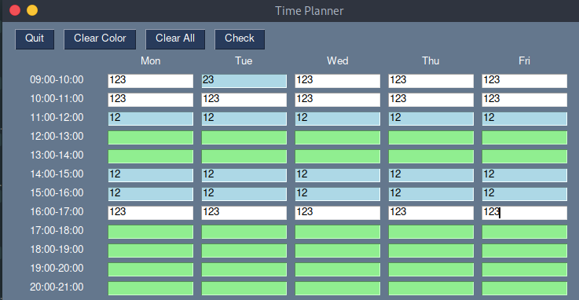

## Simple Planner

In the input fields, add the year of the students that have a lesson at that time

With Check the planner highlights as green the times when most of the students will be free, and lightblue as second best time

